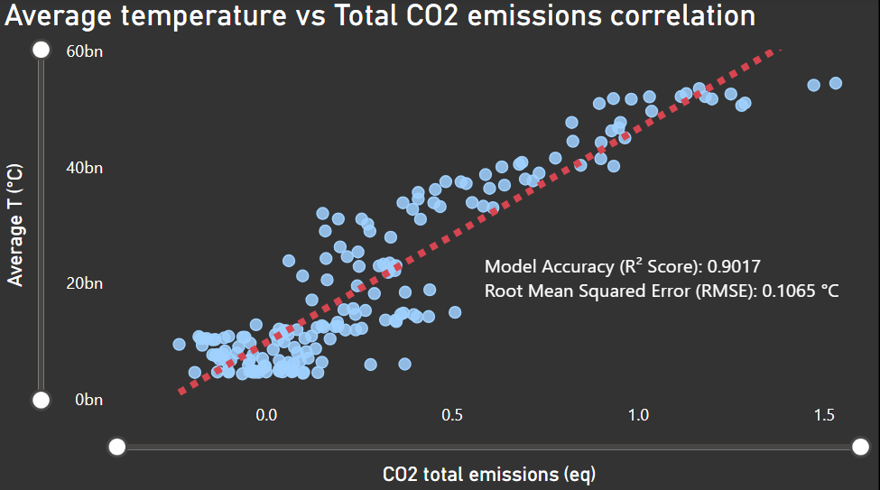

# 🌍 Data-Driven Predictive Modeling of Global Warming via Cumulative GHG Emissions


This repository contains an end-to-end Data Science and Data Engineering project linking historical anthropogenic Greenhouse Gas (GHG) emissions with global surface temperature anomalies. By establishing a robust data pipeline, we model the planet's climate trajectory under a non-linear paradigm, forecasting a critical thermal threshold heading into the year 2060.

---

## 🚀 Key Analytical Findings

* **Model Performance (R² Score):** **90.17%** of the historical global temperature variation is directly explained by cumulative GHG forcing.
* **Predictive Precision (RMSE):** A remarkably low error of just **0.1065 °C** over unseen validation testing data.
* **The 2060 Forecast:** Under an inertial *Business-As-Usual* (BAU) scenario of 1% annual growth in global emissions, the planet will reach an alarming **2.52 °C** temperature anomaly, completely breaching the safety thresholds mandated by the Paris Agreement.

---

## 🛠️ Project Architecture & Workflow

1. **Data Ingestion & Engineering (PostgreSQL 16):** Normalized and loaded multi-century raw climate records. Designed a custom SQL Database View (`global_climate_clean`) using an inner join on the spatial code `'OWID_WRL'` to collapse duplicates into a strict time-series vector (\(rows\_per\_year = 1\)).
2. **Exploratory Data Analysis (Pandas & Seaborn):** Retrieved relational views via *SQLAlchemy*. Statistical exploration unmasked the non-linear, accelerating curvature of global warming since the 1950s.
3. **Machine Learning Modeling (Scikit-learn):** Implemented an 80/20 train-test split and deployed a **Second-Degree Polynomial Regressor** (`PolynomialFeatures(degree=2)`) to accurately fit the planetary heating curve.
4. **Business Intelligence Dashboard (Power BI):** Engineered a high-contrast dark-mode executive interface integrating historical descriptive charts, geopolitical attribution shares, and flotante forecast trends up to 2060.
5. **Scientific Documentation (LaTeX):** Drafted a formal research paper detailing background, methodology, experimental results, and strategic transition-finance recommendations.

---

## 📊 Executive Dashboard Preview

*(Uncomment and fix the relative path once you save your dashboard screenshots inside the folder)*


> 💡 **Methodological Note:** The physical area under the predicted curve maps the cumulative debt of global pollution. Every year of corporate or political inaction expands this thermal volume exponentially.

---

## 📁 Repository Structure

```text
├── 📁 climate_change_db/
│   ├── final_climate_change_data.csv # Pure numeric parallel dataset generated by Python
│   ├── historical_trend.png          # Dashboard screenshot 1 (Temperature vs. Emissions)
│   ├── emissions_pie.png             # Dashboard screenshot 2 (Geopolitical attribution)
│   ├── prediction_2060.png           # Dashboard screenshot 3 (Scikit-learn projection)
│   ├── main_pipeline.ipynb           # Jupyter Notebook with full EDA & ML modeling
│   ├── views_cleanup.sql             # SQL code establishing the PostgreSQL database view
│   ├── main_report.tex               # LaTeX source code of the scientific paper
│   └── main_report.pdf               # Final compiled academic report
└── 📄 README.md                      # Repository landing page and presentation (This file)
```

---

## 👤 Author

* **Dr. Patricio Limon** - *Data Scientist & Researcher*
* [LinkedIn Profile](https://linkedin.com) | [Professional Email Contact](mailto:your.email@example.com)
